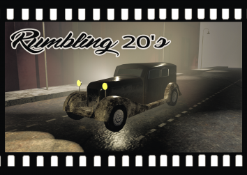

<h1>Rumbling 20's</h1>

  
Rumbling 20's is a game projected with C# and Unity during the Global Game Jam 2020.  
<b>What's the Global Game Jam?</b> The GJJ is a hackathon where you have to create a game in less than 3 days with a main topic given when the game jam starts. If you wanna know more about it, click [here](https://globalgamejam.org/about).  
The team was composed by 6 members: 3 software developers, 2 game designers, 1 2D/3D artist.  
The game has been thought to be played on Ipad, so the screen is vertical.  
Furthermore, it has been my first game jam and my first game using Unity. Due to this, I created an updated and completed version of the game; you can find it on [GitHub](https://github.com/ThrustWorld/Rumbling20-s-Remake) and on [Itch.io](https://thrustworld.itch.io/rumbling-20s-remake).  

<h3>Commands</h3>
Input: Mouse(LeftClick) --> Going to the left / Mouse(RightClick) --> Going to the right.       
Exit the game: ALT + F4.
